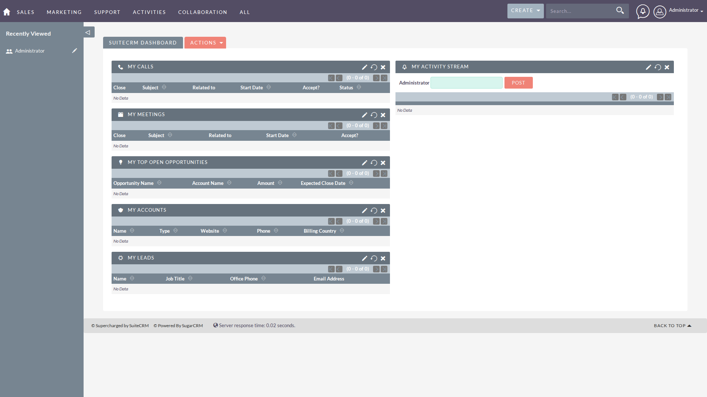
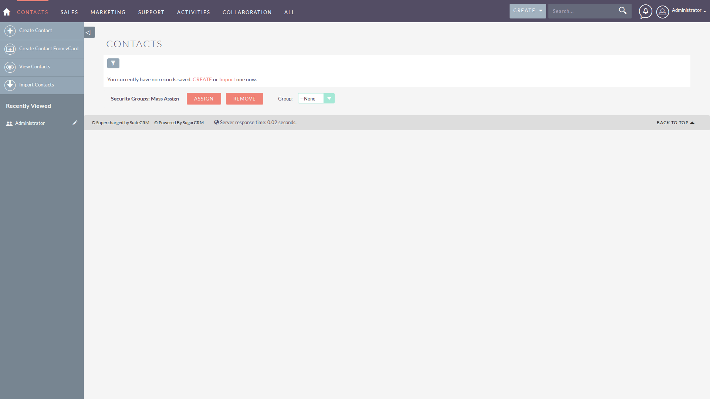
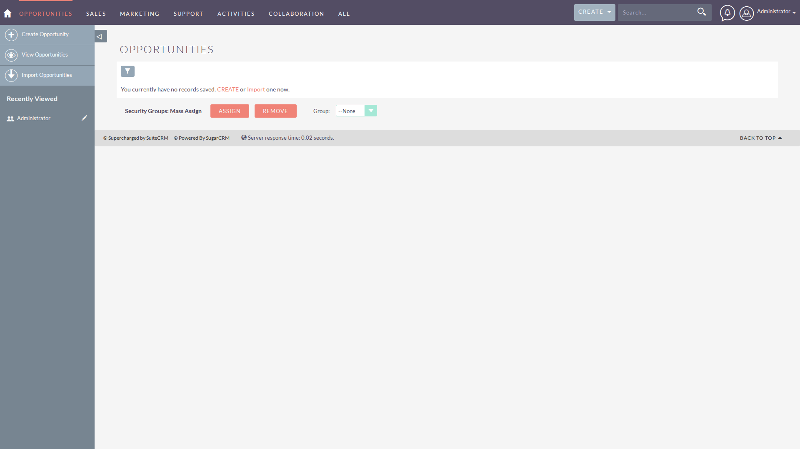
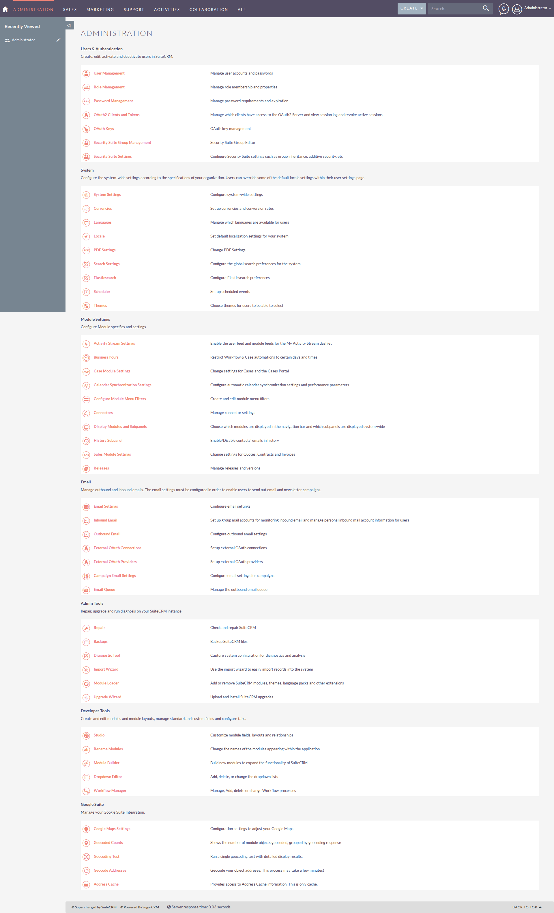

# SuiteCRM 功能模块清单

> 分析日期：2026-04-10  
> 项目版本：SuiteCRM 7.15.1  
> 分析方式：代码结构分析 + 实际部署体验

---

## 功能模块树

```
SuiteCRM 7.15.1/
├── Dashboard（主工作台）
│   ├── 首页概览
│   │   └── 统计数据卡片（线索、客户、商机、工单）
│   ├── 快捷操作
│   │   ├── 快速创建线索
│   │   ├── 快速创建联系人
│   │   ├── 快速创建客户
│   │   └── 快速创建任务
│   ├── 最近记录
│   │   ├── 最近查看
│   │   ├── 最近创建
│   │   └── 最近更新
│   └── 日程安排
│       ├── 今日会议
│       ├── 今日任务
│       └── 待处理电话
│
├── 销售管理
│   ├── 线索管理（Leads）
│   │   ├── 线索列表
│   │   │   ├── 列表视图
│   │   │   ├── 详情视图
│   │   │   ├── 筛选/搜索
│   │   │   └── 批量操作
│   │   ├── 创建线索
│   │   │   ├── 基本信息（姓名、公司、职位）
│   │   │   ├── 联系方式（电话、邮箱、地址）
│   │   │   ├── 线索来源
│   │   │   └── 状态设置
│   │   ├── 编辑线索
│   │   ├── 线索详情
│   │   │   ├── 基本信息展示
│   │   │   ├── 关联记录（联系人、客户、商机）
│   │   │   ├── 活动历史（邮件、会议、电话）
│   │   │   └── 备注/附件
│   │   └── 线索转换
│   │       ├── 转为客户
│   │       ├── 转为联系人
│   │       └── 转为商机
│   │
│   ├── 客户管理（Accounts）
│   │   ├── 客户列表
│   │   ├── 创建客户
│   │   │   ├── 客户名称
│   │   │   ├── 行业类型
│   │   │   ├── 公司规模
│   │   │   ├── 年营业额
│   │   │   └── 联系方式
│   │   ├── 编辑客户
│   │   ├── 客户详情
│   │   │   ├── 基本信息
│   │   │   ├── 关联联系人
│   │   │   ├── 关联商机
│   │   │   ├── 关联工单
│   │   │   └── 历史活动
│   │   └── 客户分配
│   │
│   ├── 联系人管理（Contacts）
│   │   ├── 联系人列表
│   │   ├── 创建联系人
│   │   │   ├── 个人信息（姓名、职位）
│   │   │   ├── 联系方式
│   │   │   ├── 所属客户
│   │   │   └── 社交账号
│   │   ├── 编辑联系人
│   │   ├── 联系人详情
│   │   └── 联系人合并
│   │
│   └── 商机管理（Opportunities）
│       ├── 商机列表
│       ├── 创建商机
│       │   ├── 商机名称
│       │   ├── 相关客户
│       │   ├── 预计金额
│       │   ├── 成交概率
│       │   ├── 预计成交日期
│       │   └── 销售阶段
│       ├── 编辑商机
│       ├── 商机详情
│       ├── 销售管道视图
│       │   ├── 看板视图
│       │   └── 拖拽更新阶段
│       └── 商机产品线
│
├── 营销管理
│   ├── 营销活动（Campaigns）
│   │   ├── 活动列表
│   │   ├── 创建活动
│   │   │   ├── 活动基本信息
│   │   │   ├── 预算设置
│   │   │   ├── 目标受众
│   │   │   └── 活动时间
│   │   ├── 编辑活动
│   │   ├── 活动详情
│   │   ├── 活动效果分析
│   │   │   ├── 发送统计
│   │   │   ├── 打开率
│   │   │   ├── 点击率
│   │   │   └── 转化率
│   │   └── 活动关联记录
│   │
│   ├── 目标列表（Target Lists）
│   │   ├── 列表管理
│   │   ├── 添加目标
│   │   └── 导入/导出
│   │
│   └── 邮件模板（Email Templates）
│       ├── 模板列表
│       ├── 创建模板
│       ├── 编辑模板
│       └── 变量插入
│
├── 客户服务
│   ├── 工单管理（Cases）
│   │   ├── 工单列表
│   │   ├── 创建工单
│   │   │   ├── 工单主题
│   │   │   ├── 优先级
│   │   │   ├── 状态
│   │   │   ├── 相关客户
│   │   │   └── 问题描述
│   │   ├── 编辑工单
│   │   ├── 工单详情
│   │   │   ├── 基本信息
│   │   │   ├── 处理历史
│   │   │   ├── 关联邮件
│   │   │   └── 备注/附件
│   │   └── 工单分配
│   │
│   ├── Bug 跟踪
│   │   ├── Bug 列表
│   │   ├── 报告 Bug
│   │   ├── Bug 状态管理
│   │   └── Bug 修复跟踪
│   │
│   └── 知识库（Knowledge Base）
│       ├── 文章列表
│       ├── 创建文章
│       ├── 文章分类
│       └── 文章搜索
│
├── 项目管理
│   ├── 项目列表
│   ├── 创建项目
│   │   ├── 项目名称
│   │   ├── 项目描述
│   │   ├── 开始/结束日期
│   │   ├── 项目状态
│   │   └── 项目成员
│   ├── 项目详情
│   ├── 项目任务
│   │   ├── 创建任务
│   │   ├── 任务分配
│   │   └── 任务进度
│   └── 项目里程碑
│
├── 日程管理
│   ├── 日历（Calendar）
│   │   ├── 月视图
│   │   ├── 周视图
│   │   ├── 日视图
│   │   └── 年视图
│   │
│   ├── 会议管理
│   │   ├── 创建会议
│   │   ├── 会议邀请
│   │   ├── 会议提醒
│   │   └── 会议纪要
│   │
│   ├── 电话记录
│   │   ├── 呼入电话
│   │   ├── 呼出电话
│   │   └── 电话备注
│   │
│   └── 任务管理
│       ├── 创建任务
│       ├── 任务优先级
│       ├── 任务截止日期
│       └── 任务完成状态
│
├── 邮件管理
│   ├── 邮件集成
│   │   ├── IMAP 配置
│   │   ├── 邮件归档
│   │   └── 邮件关联记录
│   │
│   ├── 发送邮件
│   │   ├── 撰写邮件
│   │   ├── 邮件模板
│   │   └── 批量发送
│   │
│   └── 邮件统计
│       ├── 发送统计
│       └── 邮件历史
│
├── 报告与分析
│   ├── 销售报告
│   │   ├── 线索报告
│   │   ├── 商机报告
│   │   └── 成交分析
│   │
│   ├── 营销报告
│   │   ├── 活动效果
│   │   └── 投资回报率
│   │
│   ├── 客户服务报告
│   │   ├── 工单统计
│   │   ├── 响应时间
│   │   └── 满意度
│   │
│   └── 自定义报表
│       ├── 创建报表
│       ├── 报表图表
│       └── 报表导出
│
└── 系统管理
    ├── 用户管理
    │   ├── 用户列表
    │   ├── 创建用户
    │   │   ├── 用户名/密码
    │   │   ├── 邮箱地址
    │   │   ├── 用户角色
    │   │   └── 所属团队
    │   ├── 编辑用户
    │   ├── 角色权限
    │   │   ├── 角色列表
    │   │   ├── 权限配置
    │   │   └── 访问控制
    │   └── 团队管理
    │       ├── 团队列表
    │       ├── 创建团队
    │       └── 团队成员
    │
    ├── 系统设置
    │   ├── 公司设置
    │   │   ├── 公司名称
    │   │   ├── 联系方式
    │   │   └── Logo 上传
    │   ├── 邮件设置
    │   │   ├── SMTP 配置
    │   │   ├── IMAP 配置
    │   │   └── 发件人设置
    │   ├── 安全设置
    │   │   ├── 密码策略
    │   │   ├── 登录限制
    │   │   └── IP 白名单
    │   └── 本地化设置
    │       ├── 语言
    │       ├── 时区
    │       └── 日期格式
    │
    ├── 模块构建器（Module Builder）
    │   ├── 自定义模块
    │   │   ├── 创建模块
    │   │   ├── 模块字段
    │   │   ├── 模块关系
    │   │   └── 模块布局
    │   ├── 自定义字段
    │   │   ├── 文本字段
    │   │   ├── 数字字段
    │   │   ├── 日期字段
    │   │   ├── 下拉列表
    │   │   ├── 多选列表
    │   │   └── 关联字段
    │   ├── 自定义布局
    │   │   ├── 列表布局
    │   │   ├── 详情布局
    │   │   └── 表单布局
    │   └── 导出安装包
    │
    ├── 工作流管理
    │   ├── 工作流列表
    │   ├── 创建工作流
    │   │   ├── 触发器配置
    │   │   │   ├── 模块选择
    │   │   │   ├── 触发时机（保存前/后）
    │   │   │   └── 触发条件
    │   │   └── 动作配置
    │   │       ├── 发送邮件
    │   │       ├── 更新字段
    │   │       ├── 创建记录
    │   │       ├── 分配记录
    │   │       └── 执行函数
    │   └── 工作流日志
    │
    ├── 审计日志
    │   ├── 操作日志
    │   ├── 登录日志
    │   └── 系统日志
    │
    └── 开发者工具
        ├── REST API 文档
        ├── SOAP API 文档
        ├── Logic Hooks
        └── 调度任务（Cron）
```

---

## 功能截图

### Dashboard



---

### 销售管理

#### 线索管理


#### 客户管理


#### 联系人管理


#### 商机管理


---

### 管理员功能

#### 管理控制台


---

## 功能详情

### P0 - 核心功能（必须有）

| 功能名称 | 入口位置           | 操作步骤                             | 页面元素                            | 交互逻辑                           | 对应截图                                              |
| ---- | -------------- | -------------------------------- | ------------------------------- | ------------------------------ | ------------------------------------------------- |
| 线索列表 | Dashboard → 线索 | 1. 点击线索模块<br>2. 查看列表<br>3. 筛选/搜索 | 表格、搜索框、筛选器、分页器、批量操作             | 点击姓名查看详情，筛选器改变自动刷新，支持批量操作      | ![[../../功能模块/销售管理/01-线索管理/assets/销售管理_线索管理.png]] |
| 创建线索 | 线索列表 → 创建按钮    | 1. 点击创建<br>2. 填写表单<br>3. 保存      | 姓/名 (必填)、公司、邮箱、电话、来源、状态、保存/取消按钮 | 必填字段为空时保存按钮置灰，实时格式校验，保存成功跳转详情页 | 待补充                                               |
| 线索详情 | 线索列表 → 点击姓名    | 1. 进入详情页<br>2. 查看信息<br>3. 操作     | 信息展示区、关联记录、活动历史、编辑/转换/删除按钮      | 显示完整信息，关联记录可跳转，活动历史按时间排序       | 待补充                                               |
| 编辑线索 | 线索详情 → 编辑按钮    | 1. 点击编辑<br>2. 修改字段<br>3. 保存      | 全字段可编辑表单，预填充当前数据                | 保存后刷新详情页，取消返回详情页               | 待补充                                               |
| 线索转换 | 线索详情 → 转换按钮    | 1. 点击转换<br>2. 选择目标<br>3. 确认      | 转换对话框（必选客户、可选联系人/商机）            | 必选转为客户，可选转联系人/商机，确认后跳转新客户详情页   | 待补充                                               |

### P1 - 重要功能（提升体验）

| 功能名称 | 入口位置           | 操作步骤                                         | 页面元素                   | 交互逻辑            |
| ---- | -------------- | -------------------------------------------- | ---------------------- | --------------- |
| 线索转换 | 线索详情           | 1. 打开线索详情<br>2. 点击"转换"<br>3. 选择转换目标<br>4. 确认 | 转为客户/联系人/商机选项、确认按钮     | 转换后线索状态变更为"已转换" |
| 销售管道 | 商机 → 看板视图      | 1. 进入商机模块<br>2. 切换看板视图<br>3. 拖拽商机卡片          | 阶段列、商机卡片、拖拽手柄          | 拖拽后自动更新商机阶段     |
| 邮件集成 | 系统设置 → 邮件      | 1. 配置 IMAP/SMTP<br>2. 测试连接<br>3. 启用归档        | SMTP 服务器、端口、账号、密码、测试按钮 | 测试成功后可收发邮件      |
| 报告分析 | Dashboard → 报告 | 1. 选择报告类型<br>2. 设置筛选条件<br>3. 生成报告<br>4. 导出   | 报告类型、筛选器、图表、导出按钮       | 生成后显示图表和数据表格    |
| 工作流  | 系统管理 → 工作流     | 1. 创建工作流<br>2. 配置触发器<br>3. 配置动作<br>4. 启用     | 模块选择、触发条件、动作类型、启用开关    | 满足条件时自动执行动作     |

### P2 - 锦上添花（可选）

| 功能名称 | 说明 |
|----------|------|
| 知识库 | 内部知识共享和 FAQ 管理 |
| Bug 跟踪 | 软件缺陷跟踪和管理 |
| 项目里程碑 | 项目进度节点管理 |
| 目标列表 | 营销活动目标受众管理 |
| 审计日志 | 系统操作审计和合规性 |

---

## 亮点功能验证

### 亮点 1：企业级功能完整性

- **位置**：全系统
- **实际表现**：
  - 销售全流程：线索 → 客户 → 联系人 → 商机 → 成交
  - 营销自动化：活动创建 → 目标列表 → 邮件发送 → 效果分析
  - 客户服务：工单创建 → 分配 → 处理 → 关闭 → 满意度
  - 项目管理：项目 → 任务 → 里程碑 → 进度跟踪
- **与战略规划报告对比**：一致，功能覆盖销售、营销、客服全流程
- **差异化价值**：开源 CRM 中功能最完整的之一，可直接替代商业 CRM

### 亮点 2：自定义模块系统（Module Builder）

- **位置**：系统管理 → 模块构建器
- **实际表现**：
  - 可视化创建自定义模块（如"车辆管理"、"设备管理"）
  - 自定义字段类型（文本、数字、日期、下拉、多选、关联等）
  - 定义模块间关系（一对多、多对多）
  - 自定义列表、详情、表单布局
  - 导出为安装包，可导入到其他实例
- **差异化价值**：允许企业根据业务需求完全定制 CRM，无需修改代码

### 亮点 3：工作流和业务流程管理

- **位置**：系统管理 → 工作流管理
- **实际表现**：
  - 触发器：模块选择（线索/客户/商机等）、触发时机（保存前/后/删除）、触发条件（字段值判断）
  - 动作：发送邮件、更新字段、创建记录、分配记录、执行自定义函数
  - 定时任务：基于 cron 的调度任务
  - 逻辑钩子（Logic Hooks）：代码级扩展点
- **差异化价值**：内置业务自动化引擎，无需第三方集成即可实现复杂业务流程

---

## API 端点

### REST API

- **基础路径**：`/service/v4_1/rest.php`
- **支持操作**：
  - `login` - 用户登录
  - `get_entry` - 获取记录详情
  - `set_entry` - 创建/更新记录
  - `delete_entry` - 删除记录
  - `query` - 查询记录列表
  - `module_fields` - 获取模块字段
  - `set_relationship` - 设置关联关系
  - `get_relationship` - 获取关联记录

### SOAP API

- **WSDL 地址**：`/service/v4_1/soap.php?wsdl`
- **支持操作**：与 REST API 类似，使用 SOAP 协议

---

## 数据库表结构（部分核心表）

| 表名 | 说明 | 主要字段 |
|------|------|----------|
| `leads` | 线索表 | id, first_name, last_name, company, title, email, phone, lead_source, status |
| `accounts` | 客户表 | id, name, industry, annual_revenue, phone, website |
| `contacts` | 联系人表 | id, first_name, last_name, title, email, phone, account_id |
| `opportunities` | 商机表 | id, name, account_id, amount, probability, sales_stage, date_closed |
| `cases` | 工单表 | id, name, status, priority, account_id, description |
| `users` | 用户表 | id, user_name, first_name, last_name, email, user_hash |
| `campaigns` | 营销活动表 | id, name, status, budget, start_date, end_date |
| `meetings` | 会议表 | id, name, date_start, duration, status, location |
| `tasks` | 任务表 | id, name, status, priority, date_due, description |

---

## 总结

### 功能覆盖度

| 模块类型 | 功能数量 | 覆盖度 |
|----------|----------|--------|
| 销售管理 | 4 个核心模块，30+ 功能 | ⭐⭐⭐⭐⭐ |
| 营销管理 | 3 个模块，15+ 功能 | ⭐⭐⭐⭐ |
| 客户服务 | 3 个模块，20+ 功能 | ⭐⭐⭐⭐⭐ |
| 项目管理 | 1 个模块，10+ 功能 | ⭐⭐⭐⭐ |
| 日程管理 | 4 个模块，15+ 功能 | ⭐⭐⭐⭐⭐ |
| 系统管理 | 6 个模块，50+ 功能 | ⭐⭐⭐⭐⭐ |

### 功能完整性评分：4.5 / 5.0

**加分项**：
- ✅ 完整的销售、营销、客服全流程覆盖
- ✅ 强大的自定义模块系统
- ✅ 内置工作流自动化引擎
- ✅ 完整的 REST/SOAP API
- ✅ 多语言、多时区支持

**减分项**：
- ⚠️ UI/UX 设计相对传统（Smarty 模板渲染）
- ⚠️ 部分功能需要编程能力进行定制

---

**清单生成时间**：2026-04-10  
**分析工程师**：角色 2 - 部署与截图工程师  
**状态**：✅ 完成（已更新截图）
