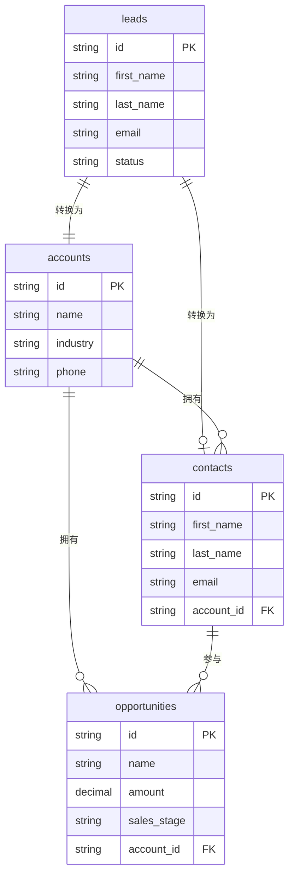
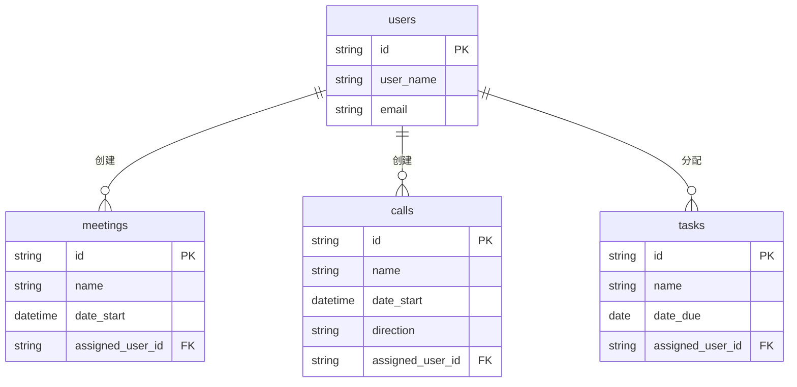
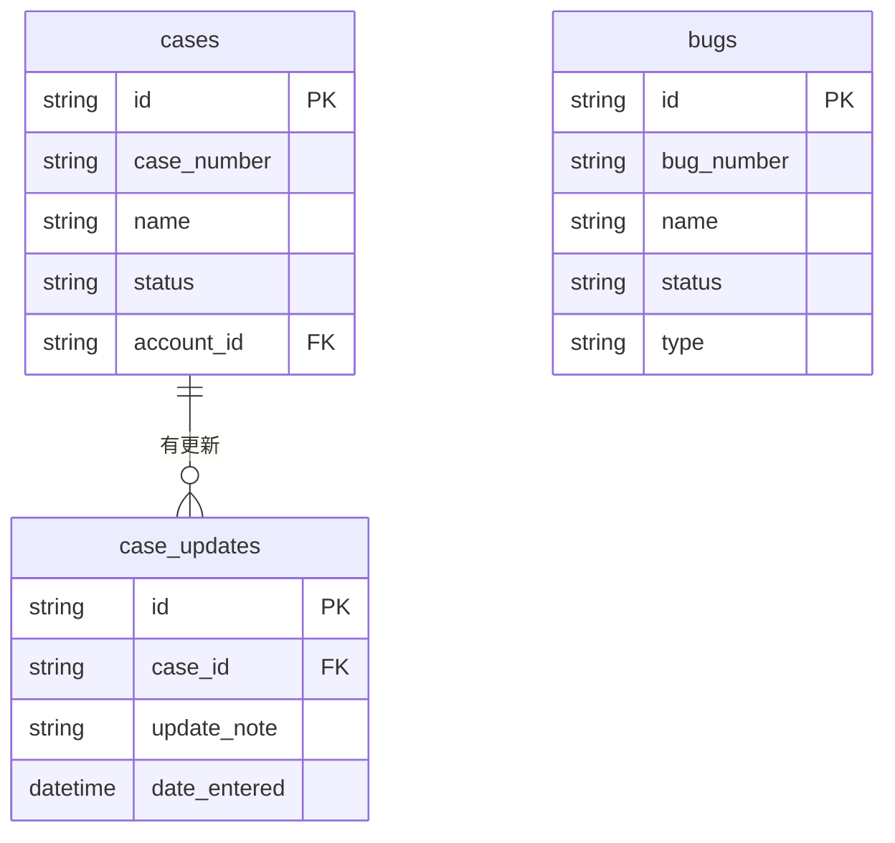
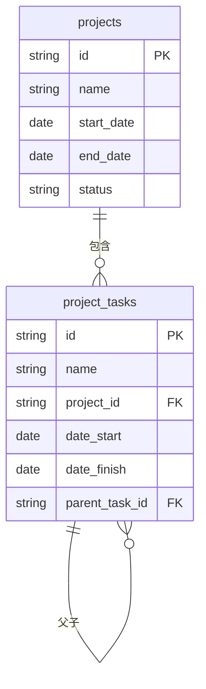
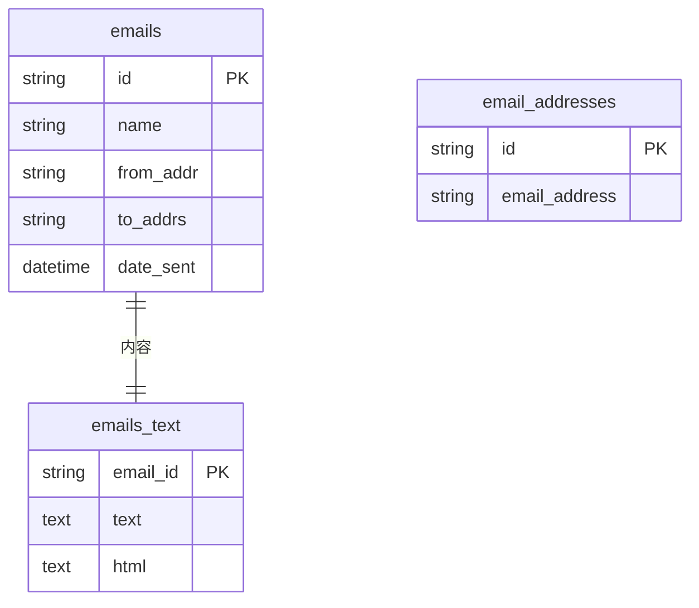
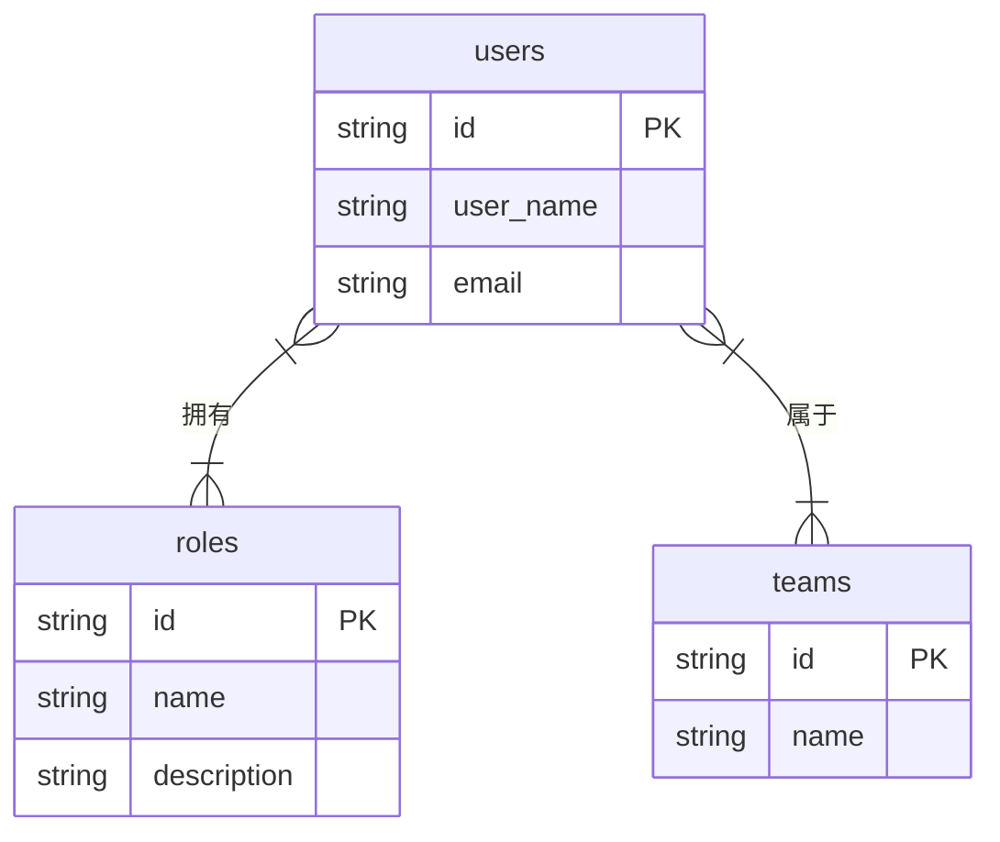

# SuiteCRM 数据库实体关系图

> **版本**：SuiteCRM 7.15.1  
> **生成日期**：2026-04-16  

---

## 一、系统表总览（41 张表）

### 核心业务表（14 张）

| 序号 | 表名 | 中文名 | 作用 |
|:----:|------|--------|------|
| 1 | `leads` | 线索表 | 存储潜在客户的原始信息 |
| 2 | `accounts` | 客户表 | 存储公司/组织信息 |
| 3 | `contacts` | 联系人表 | 存储个人联系信息 |
| 4 | `opportunities` | 商机表 | 存储销售机会信息 |
| 5 | `cases` | 工单表 | 存储客户服务请求 |
| 6 | `bugs` | Bug 表 | 存储软件缺陷记录 |
| 7 | `projects` | 项目表 | 存储项目信息 |
| 8 | `project_tasks` | 项目任务表 | 存储项目下的任务 |
| 9 | `meetings` | 会议表 | 存储会议安排 |
| 10 | `calls` | 电话表 | 存储通话记录 |
| 11 | `tasks` | 任务表 | 存储待办任务 |
| 12 | `emails` | 邮件表 | 存储邮件头信息 |
| 13 | `emails_text` | 邮件内容表 | 存储邮件正文 |
| 14 | `email_addresses` | 邮件地址表 | 存储邮箱地址 |

### 用户权限表（5 张）

| 序号 | 表名 | 作用 |
|:----:|------|------|
| 15 | `users` | 系统登录用户 |
| 16 | `roles` | 权限角色定义 |
| 17 | `teams` | 用户团队分组 |
| 18 | `acl` | 权限控制规则 |
| 19 | `acl_actions` | 可控制的操作 |

### 关联表（9 张）

| 序号 | 表名 | 作用 |
|:----:|------|------|
| 20 | `accounts_contacts` | 客户 - 联系人关联 |
| 21 | `roles_users` | 用户 - 角色关联 |
| 22 | `teams_users` | 团队 - 用户关联 |
| 23 | `meetings_users` | 会议 - 参与者关联 |
| 24 | `meetings_contacts` | 会议 - 联系人关联 |
| 25 | `calls_users` | 电话 - 参与者关联 |
| 26 | `bugs_cases` | Bug-工单关联 |
| 27 | `emails_email_addr_rel` | 邮件 - 地址关联 |
| 28 | `case_updates` | 工单更新历史 |

---

## 二、核心业务流程

```
线索 (leads) 
  ↓ 转换
客户 (accounts) + 联系人 (contacts) + 商机 (opportunities)
  ↓ 成交
项目 (projects) / 工单 (cases)
```

---

## 三、按模块 ERD 关系图

### 模块 1：销售管理（核心）

**涉及的表**：leads, accounts, contacts, opportunities



**连线说明**：
- `leads → accounts`：线索转换后**一定**变成一个客户（1:1）
- `leads → contacts`：线索转换后**可能**变成一个联系人（1:0..1）
- `accounts → contacts`：一个客户可以有**多个**联系人（1:N）
- `accounts → opportunities`：一个客户可以有**多个**商机（1:N）

---

### 模块 2：活动与日程

**涉及的表**：users, meetings, calls, tasks



**连线说明**：
- 所有连线都是 `||--o{`（一对多）
- 一个用户可以创建**多个**会议、电话，可以被分配**多个**任务

---

### 模块 3：客户服务

**涉及的表**：cases, bugs, case_updates



**连线说明**：
- `cases → case_updates`：一个工单可以有**多条**更新记录（1:N）
- `bugs` 和 `cases` 是多对多关系，通过 `bugs_cases` 中间表关联（图中未显示）

---

### 模块 4：项目管理

**涉及的表**：projects, project_tasks



**连线说明**：
- `projects → project_tasks`：一个项目包含**多个**任务（1:N）
- `project_tasks → project_tasks`：一个任务可以有**多个**子任务（1:N 自引用）

---

### 模块 5：邮件管理

**涉及的表**：emails, emails_text, email_addresses



**连线说明**：
- `emails → emails_text`：一封邮件对应**唯一**一份内容（1:1）
- `emails` 和 `email_addresses` 通过中间表关联（图中未显示）

---

### 模块 6：用户权限

**涉及的表**：users, roles, teams



**连线说明**：
- `users ↔ roles`：多对多（N:M），一个用户有多个角色，一个角色有多个用户
- `users ↔ teams`：多对多（N:M），一个用户属于多个团队，一个团队有多个用户

---

## 四、符号与实际连线对照

### 符号含义速查

先看这个表，再对照上面的 ERD 图：

| 符号 | 名称 | 含义 | 图中例子 |
|------|------|------|---------|
| `||--o{` | 一对多 | 一个父记录对应多个子记录 | `accounts ||--o{ contacts`（客户→联系人） |
| `||--||` | 一对一 | 两个记录一一绑定 | `emails ||--|| emails_text`（邮件→内容） |
| `||--o|` | 一对零或一 | 可能存在，也可能不存在 | `leads ||--o| contacts`（线索→联系人） |
| `}|--|{` | 多对多 | 通过中间表关联 | `users }|--|{ roles`（用户→角色） |

### 符号拆解（怎么看懂符号）

```
      一对多：||--o{
      
      ||--o{
      ││  │└─ 叉 {  表示"多"（可以有多个）
      ││  └── 圆圈 o  表示"可选"（可以没有）
      │└── 竖线 |  表示"一"（必须有一个）
      └── 竖线 |  表示"一"（必须有一个）
      
      读作：一端必须有一个，另一端可以有零个或多个
```

### 所有连线汇总（按符号分类）

**一对多 `||--o{` （7 处）**
- `accounts ||--o{ contacts` - 客户拥有联系人
- `accounts ||--o{ opportunities` - 客户拥有商机
- `contacts ||--o{ opportunities` - 联系人参与商机
- `users ||--o{ meetings` - 用户创建会议
- `users ||--o{ calls` - 用户创建电话
- `users ||--o{ tasks` - 用户分配任务
- `cases ||--o{ case_updates` - 工单有更新
- `projects ||--o{ project_tasks` - 项目包含任务
- `project_tasks ||--o{ project_tasks` - 任务有子任务

**一对一 `||--||` （2 处）**
- `leads ||--|| accounts` - 线索转换为客户
- `emails ||--|| emails_text` - 邮件对应内容

**一对零或一 `||--o|` （1 处）**
- `leads ||--o| contacts` - 线索可能转换为联系人

**多对多 `}|--|{`（2 处）**
- `users }|--|{ roles` - 用户拥有角色
- `users }|--|{ teams` - 用户属于团队

---

**生成时间**：2026-04-16
